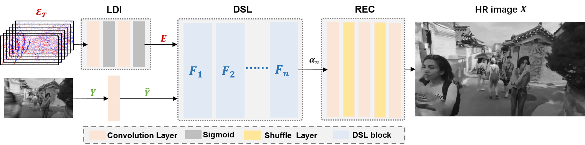
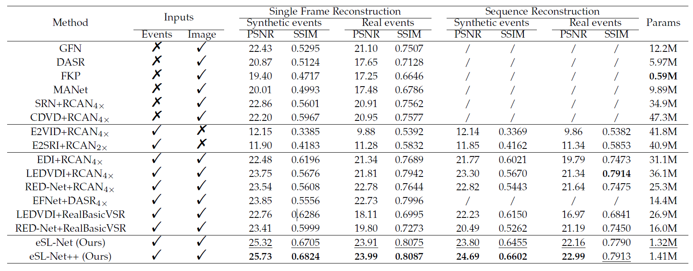

# eSL-Net++

This repository contains the official PyTorch implementation of the paper: Learning to Super-Resolve Blurry Images with Events.

## Introduction
Super-Resolution from a single motion Blurred image (SRB) is a severely ill-posed problem due to the joint degradation of motion blurs and low spatial resolution.
To address this, we employ events to alleviate the burden of SRB and propose an Event-enhanced SRB (E-SRB) algorithm, which can generate a sequence of sharp and clear images with High Resolution (HR) from a single blurry image with Low Resolution (LR). Specifically, we first formulate an event-enhanced degeneration model to consider the low spatial resolution, motion blurs, and event noises simultaneously, and then build an event-enhanced Sparse Learning Network (eSL-Net++) upon a dual sparse learning scheme where both events and intensity frames are modeled with sparse representations.

<div  align="center">    
   
</div>


## Results
Experimental results on synthetic and real-world datasets show that the proposed eSL-Net++ outperforms state-of-the-art methods by a large margin.
#### Quantitative Comparisons

<div  align="center">    
   
</div>

#### Qualitative Comparisons

synthetic GoPro dataset

<div  align="center">    
   
</div>

HQF dataset

<div  align="center">    
   
</div>

real-world scenes (RWS) dataset

<div  align="center">    
   
</div>

## Environment setup

#### Environment

- Linux
- CUDA 8.0/9.0
- gcc 4.9+
- python 2.7+

#### Dependencies

- pytorch >=1.0.0
- torchvision
- argparse
- numpy
- opencv-python
- scipy

You can create a new [Anaconda](https://www.anaconda.com/products/individual) environment with the above dependencies as follows.
Please make sure to adapt the CUDA toolkit version according to your setup when installing torch and torchvision.

```
conda create -n eslnet python=3.6
conda activate eslnet
conda install pytorch torchvision cudatoolkit -c pytorch
pip install argparse numpy opencv-python scipy 
```

## Download data and pretrained model

#### Data

You can download them via [Google Drive](https://drive.google.com/drive/folders/1ODMevq1aeVuIXCiDpSzEbaJ6cZNowIEe?usp=sharing).

There are three kinds of testing data:

- synthetic GoPro dataset (**gopro_test**) from [GoPro dataset](https://seungjunnah.github.io/Datasets/reds.html) and [ESIM](http://rpg.ifi.uzh.ch/esim.html),
- HQF dataset (**HQF_test**) from [HQF](https://timostoff.github.io/20ecnn)
- real-world scenes (RWS) dataset (**realdata_test**) that we took with DAVIS346.

#### Pretrained model

Pretrained model can be downloaded via [Google Drive](https://drive.google.com/drive/folders/1e7ReB_2no5QWJm4JHloD3365baymTOfd?usp=sharing). 

## Quick start

#### Initialization

- Create directory for testing data

  `mkdir test_data`

  copy the testing data to directory './test_data/'

- Create directory for pretrained model

  `mkdir pre_trained`

  copy the pretrained model to directory './pre_trained/'

- Change the parent directory to './code/'

  `cd code`

#### Testing on synthetic GoPro dataset

Use the following command to test eSL-Net++ on synthetic GoPro dataset:

```
python test.py  \
--name test \
--model  eSL-Net++_sr  \
--load_G '../pre_trained/esl_plusplus_sr_pretrained.pt' \
--dataset_mode gopro \
--img_start_idx 16 \
--img_inter_idx 3 \
--num_frames_for_blur 1 \
--input_blur_path  '../test_data/gopro_test/blur_images/' \
--input_event_path '../test_data/gopro_test/eventstream_mat/' \
--output_dir '../method_results/gopro_test/' \
--cuda
```

OR you can execute the script test_gopro.sh directly:

`bash test_gopro.sh ` 

#### Testing on HQF dataset

You can execute the script test_hqf.sh directly:

`bash test_hqf.sh ` 

#### Testing on RWS dataset

You can execute the script test_realdata.sh directly:

`bash test_realdata.sh ` 

## Parameters

Below is a description of the most important parameters:

#### Main parameters

- `--model` : Choose model, including: `eSL-Net++_sr`,` eSL-Net++_dn`, `eSL-Net_sr`, `eSL-Net_dn`
- `--load_G`: Path of the pretrained model.
- `--dataset_mode`: The mode of loading dataset, including: `gopro`, `realdata`
- `--num_frames_for_blur` : The number of output sharp images for one input blurry image.
- `--cuda` : If you use GPU to test, please activate the parameter.

#### Input parameters

- `--input_blur_path` : Path of the input blurry images folder.
- `--input_event_path` : Path of the input event stream folder. If you choose `realdata` in`--dataset_mode`, the parameter is invalid.

#### Output parameters

- `--img_start_idx` : For a video sequence, the starting index number of the saving output images.
- `--img_inter_idx` : For a video sequence, the index number of intervals between two consecutive output images.
- `--output_dir` : Path of the output folder.

## Citation

If you find our work useful in your research, please cite the following publications:

1. [eSL-Net](https://www.ecva.net/papers/eccv_2020/papers_ECCV/papers/123580154.pdf)

```
@inproceedings{wang2020event,
  title={Event enhanced high-quality image recovery},
  author={Wang, Bishan and He, Jingwei and Yu, Lei and Xia, Gui-Song and Yang, Wen},
  booktitle={Computer Vision--ECCV 2020: 16th European Conference, Glasgow, UK, August 23--28, 2020, Proceedings, Part XIII 16},
  pages={155--171},
  year={2020},
  organization={Springer}
}
```

2. eSL-Net++ (has been submitted)

```
@article{yu2022learning,
  title={Learning to Super-Resolve Blurry Images with Events},
  author={Yu, Lei and Wang, Bishan and Zhang, Xiang and Zhang, Haijian and Yang, Wen and Liu, Jianzhuang and Xia, Gui-Song},
  year={2022},
}
```
